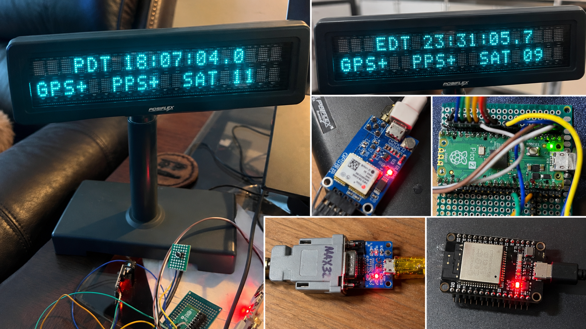

# Absurdly Accurate Clock

Minimal C++ firmware for Raspberry Pi Pico 2 (RP2350), using PlatformIO and
Earle Philhower's Arduino-Pico core. Open this directory in PlatformIO.



*Real AAC development hardware photographed during bring-up and testing.*

## Build

```sh
pio run -e pico2
pio run -e pico2 -t upload
pio device monitor -b 115200
```

The first build needs network access for the platform, core, and tools.
For the first USB upload, hold BOOTSEL while connecting the Pico 2. Alternatively,
copy `.pio/build/pico2/firmware.uf2` to its BOOTSEL drive. Uploading is separate
from building; no hardware is programmed by `pio run` alone.

The platform is pinned to `5d4561a05e3b212660ac6fdd3fbfb328d1988aa1` in
[maxgerhardt/platform-raspberrypi](https://github.com/maxgerhardt/platform-raspberrypi).
Its [rpipico2 board manifest](https://github.com/maxgerhardt/platform-raspberrypi/blob/5d4561a05e3b212660ac6fdd3fbfb328d1988aa1/boards/rpipico2.json)
selects RP2350, Cortex-M33, 150 MHz, 4 MiB flash and 512 KiB RAM.
This follows the [Arduino-Pico PlatformIO instructions](https://arduino-pico.readthedocs.io/en/latest/platformio.html).
Do not substitute the original Pico's `pico` board configuration. The explicit
integration URL avoids relying on ambiguous registry platform support.

## Display timezone button

GP6 (physical pin 9) selects UTC → Eastern → Central → Mountain → Pacific → UTC.
Connect the button to GND; the internal pull-up is enabled. Each press/release is
debounced for 30 ms, and holding does not repeat. Reset returns to UTC.
Authoritative time remains UTC; local time uses contemporary U.S. DST rules only
at the display boundary. See [timezone and HH diagnostics](docs/display-timezone.md)
for rules, serial record formats and bench checks.

## Layout and architecture

- `src/main.cpp`: cooperative GPS/PPS, button, display and USB diagnostic servicing.
- `src/hardware.cpp` and `include/hardware.hpp`: UART and input initialization.
- `src/pd2200.cpp` and `include/pd2200.hpp`: initial Noritake VFD bring-up.
- `include/pins.hpp`: single source of truth for the GPIO contract.
- `include/clock_state.hpp`: authoritative UTC timebase, initially invalid and unlocked.
- `src/display_time.cpp`: presentation-only civil time and contemporary U.S. DST.
- `src/zone_button.cpp`: non-blocking debounced display-zone selection.
- `lib/`: future reusable C++ components; `test/`: host regression tests.
- `Paper-Documents/`: existing PDFs and paper/project documentation. Preserve
  this directory and its contents; it is not generated output or firmware data.

GPS RMC labels are associated with PPS edges by the UTC timebase. Canonical time
stays UTC; local-time conversion belongs at the display boundary. See
[timebase contract](docs/pps-timebase.md) for association and validity behavior.

The reference physical build uses a Posiflex PD-2200 serial VFD, but that display
is not fundamental to the clock architecture: the UTC timekeeping core is
independent of it. The current VFD layer is hardware-specific and can be replaced
or adapted for another serial/UART or embedded display; reproducing the project
does not require finding the same Posiflex model.

The display module sends Posiflex PD-2200 commands in **Noritake mode**
over UART1 through the MAX3232. Select Noritake mode and 9600 baud, 8N1 on the
actual display. Startup waits 500 ms, sends reset (`ESC I`), waits 100 ms,
disables the cursor (`16` hex), sets minimum brightness (`1B 4C 3F` hex),
then clears (`0E` hex) and homes (`0C` hex). Direct cursor positioning
(`ESC H`, zero-based cell address) precedes short initialized fields and changed
characters. The display shows the selected zone, HH:MM:SS and PPS-synchronized
rolling decade, with GPS/PPS/SAT on the lower row. No USB host is required.
The companion [aac-time-bridge](https://github.com/rhaag71/aac-time-bridge) is an
ESP32 network-time/NTP appliance that consumes the Pico's SPI protocol and
qualified TIME_SYNC signal. The Pico remains the authoritative timekeeper and
runs standalone without the ESP32. [Protocol v1](docs/clock-network-protocol.md)
specifies the wiring, packet and phase-delay semantics, including the SPI reset
and TX-priming lifecycle required for reliable byte alignment. Nothing received
from the ESP32 can change Pico time.

## Unattended recovery

The RP2350 hardware watchdog recovers a wedged firmware main loop after **4,000 ms**
without a feed. It is enabled at the start of setup (covering startup stalls too)
and fed only after all recurring main-loop services complete, never by an ISR or
timer. This leaves ample margin over the 600 ms of VFD startup delays and UART
drain; normal loop work is bounded. GPS/PPS loss, invalid UTC, display faults or
backpressure, and an absent ESP32 do not intentionally cause resets.

Recovery follows normal startup: GPS/UTC validity, PPS lock and TIME_SYNC validity
must be acquired again by the existing rules. Nothing preserves time quality
across reset. The SDK's RP2350-aware `watchdog_caused_reboot()` is sampled before
enabling the watchdog. A watchdog boot queues `RESET: watchdog` on USB serial
alongside existing diagnostics (subject to the existing bounded queue/host
availability). It also queues `RESET=WATCHDOG` after every fifth ordinary diagnostic
message for the remainder of that boot, so the cause remains observable after USB
reconnects. The marker does not count itself; cadence follows diagnostic activity
(potentially several minutes when quiet), with the same queue/drop policy. Normal
boots emit no periodic reset marker. The heartbeat toggles every 250 ms for that entire session instead
of the normal 500 ms: 2 Hz versus 1 Hz full blink cycles. Reacquisition does not
clear the faster cadence; a normal power cycle/reset restores normal cadence.
This is a liveness/reset diagnostic, independent of all time and network quality.

### Physical watchdog bench test

Use an SWD debugger with the production firmware; no firmware test hook is needed.
After normal startup, halt the application core at `loop()` and leave it halted
for more than four seconds. Watchdog debug pause is disabled. Configure the
debugger not to catch/hold reset or automatically re-halt the restarted target,
then detach without issuing another reset so startup can run. Confirm a hardware
reset about four seconds after the last feed, reconnect USB serial promptly to
observe `RESET: watchdog`, and check the persistent 250 ms LED toggle interval.
With GPS/PPS withheld, confirm invalid time/no qualified TIME_SYNC; restore them
and confirm normal reacquisition while the faster heartbeat persists. Finally
power-cycle and check the normal 500 ms interval. Separately run with missing
GPS/PPS, disconnected display, and absent ESP32 for longer than four seconds to
check that degraded operation alone does not reset. Host tests cannot establish
the physical reset behavior or exact timeout; record those on the bench.

## Verified VFD wiring

Bench testing verified Pico 2 GP4 (physical pin 6) UART TX at 9600 baud on an
oscilloscope using continuous `0x55` (ASCII `U`). The VFD then successfully
displayed those characters through the MAX3232 with the wiring below.

The tested MAX3232 module has misleading signal-direction labels: connect
**Pico GP4 TX to the module header labeled TXD, not RXD**. GP4 remains the
project's VFD UART TX pin; the module labeling does not change the GPIO contract.

| Source | Destination |
| --- | --- |
| Pico GP4 / physical pin 6 | MAX3232 TTL header labeled TXD |
| Pico GND | MAX3232 GND |
| MAX3232 DB9 pin 2 (RS-232 transmit output) | Posiflex DB9 pin 3 (receive input) |
| MAX3232 DB9 pin 5 | Posiflex DB9 pin 5 (signal ground) |

The **DB9 pin 2 to pin 3 crossover is required** for this tested module/display
combination. The PD-2200 is powered separately and configured for Noritake mode,
9600 baud, 8N1. These labeling and wiring findings apply to the tested module.
The temporary continuous-`U` diagnostic firmware has been removed; normal
firmware sends the clock/status fields described above.

## GPIO contract

All numbers below are GPIO numbers, not physical header positions. TX/RX and
input/output directions are relative to the Pico.

| GPIO | Assignment |
| --- | --- |
| GP0 | GPS UART0 TX (`Serial1`) |
| GP1 | GPS UART0 RX (`Serial1`) |
| GP2 | GPS PPS input |
| GP4 | PD-2200 UART1 TX (`Serial2`) via MAX3232 |
| GP5 | UART1 RX, reserved and disabled |
| GP6 | UI button input; pull-up, button to GND |
| GP8 | SPI1 RX input / ESP32 MOSI -> Pico (header 11) |
| GP9 | SPI1 CSn input from ESP32 (header 12) |
| GP10 | SPI1 SCK input from ESP32 (header 14) |
| GP11 | SPI1 TX output / Pico -> ESP32 MISO (header 15) |
| GP12 | Qualified TIME_SYNC output (header 16) |
| GP13 | Reserved future ESP32 control/IRQ |
| GP14–GP22 | Open for future expansion |

GP3 and GP7 are also unassigned. GP13 remains reserved and is not initialized. SPI1 uses native hardware, not PIO.
Both UARTs currently use **9600 baud, 8N1**, explicit bring-up assumptions in
`src/main.cpp`; confirm them against the GPS configuration and VFD switches.
USB `Serial` is separate from both hardware UARTs. The network interface works without a connected SPI controller.

## License

This project is licensed under the [MIT License](LICENSE).
